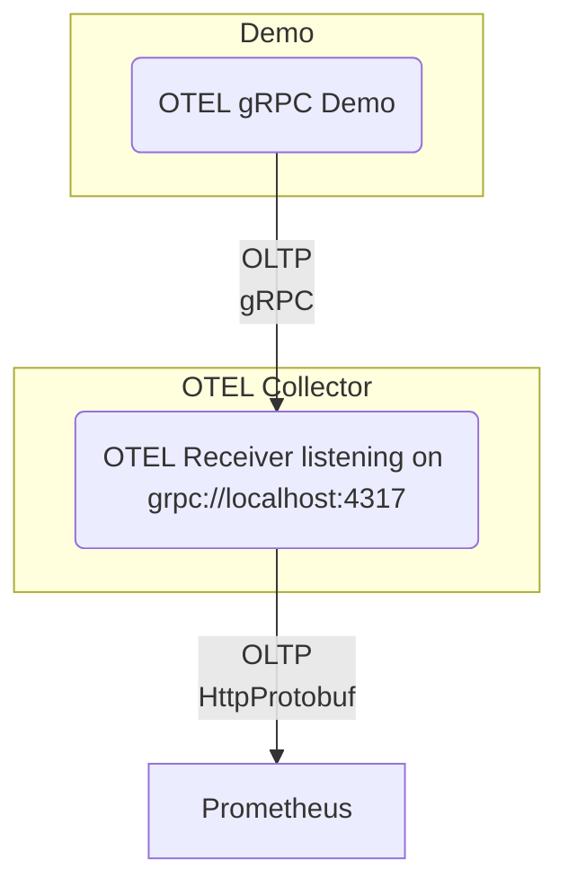

# OpenTelemetry metrics over gRPC demo

## Overview

This is a simple project, showing how to send metrics from a Rust application to an OpenTelemetry Collector over gRPC.



## How to run

To run the demo, you need to have rust, Docker and Docker Compose installed.

After that, you can run the following commands to get the demo build, then up and running:

```bash
# Build the demo
make

# Run the demo
make run
```

If it succeeds, you should see output similar to the following:

```text
$ make run
cd ./services && docker compose up -d
[+] Running 1/0
 ✔ Container otel-collector  Running                                                                                                                                            0.0s 

RUST_LOG=info cargo run
    Finished `dev` profile [unoptimized + debuginfo] target(s) in 0.06s
     Running `target/debug/otel-grpc-demo`
2024-09-25T07:09:45.875781Z  INFO otel_grpc_demo: Starting up
2024-09-25T07:09:45.876105Z  INFO otel_grpc_demo: Logging metrics
2024-09-25T07:09:46.876938Z  INFO otel_grpc_demo: Logging metrics
2024-09-25T07:09:47.878667Z  INFO otel_grpc_demo: Logging metrics
2024-09-25T07:09:48.880204Z  INFO otel_grpc_demo: Logging metrics
2024-09-25T07:09:49.881947Z  INFO otel_grpc_demo: Logging metrics
2024-09-25T07:09:50.883793Z  INFO otel_grpc_demo: Logging metrics
2024-09-25T07:09:51.885598Z  INFO otel_grpc_demo: Logging metrics
2024-09-25T07:09:52.887384Z  INFO otel_grpc_demo: Logging metrics
2024-09-25T07:09:53.888029Z  INFO otel_grpc_demo: Logging metrics
2024-09-25T07:09:54.889813Z  INFO otel_grpc_demo: Logging metrics
2024-09-25T07:09:55.891576Z  INFO otel_grpc_demo: Shutting down
2024-09-25T07:09:55.891603Z  INFO otel_grpc_demo::otel::metrics: MetricStore shutting down

curl http://localhost:8889/metrics
# HELP port_rx_bytes_total 
# TYPE port_rx_bytes_total counter
port_rx_bytes_total{instance="0",job="otel-grpc-demo",os_name="demo-os",os_type="demo-os",os_version="202411.0",port_id="0"} 100000
# HELP queue_watermark 
# TYPE queue_watermark gauge
queue_watermark{instance="0",job="otel-grpc-demo",os_name="demo-os",os_type="demo-os",os_version="202411.0",queue_id="3"} 23456
# HELP target_info Target metadata
# TYPE target_info gauge
target_info{container_image_id="202411.0",container_image_name="demo",device_id="r12f-dev",device_manufacturer="r12f",device_model_name="devbox",host_ip="1.2.3.4",instance="0",job="otel-grpc-demo"} 1
```
